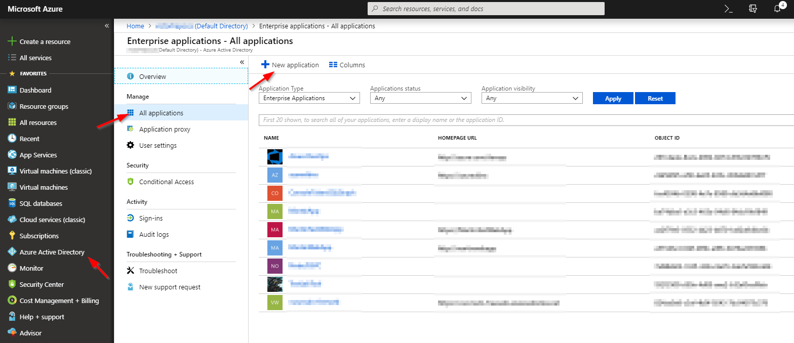
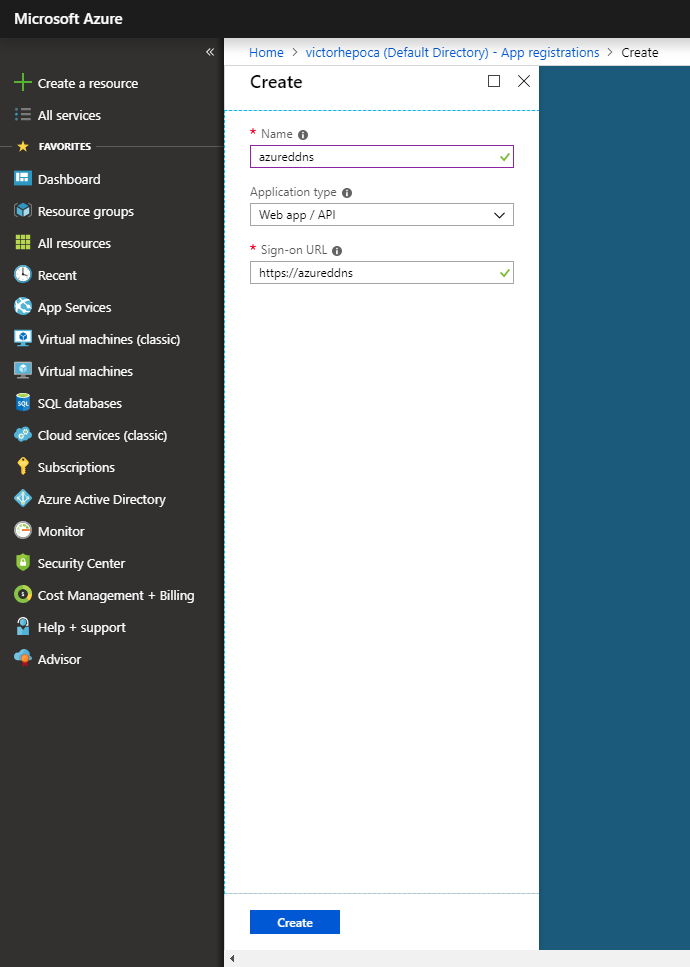
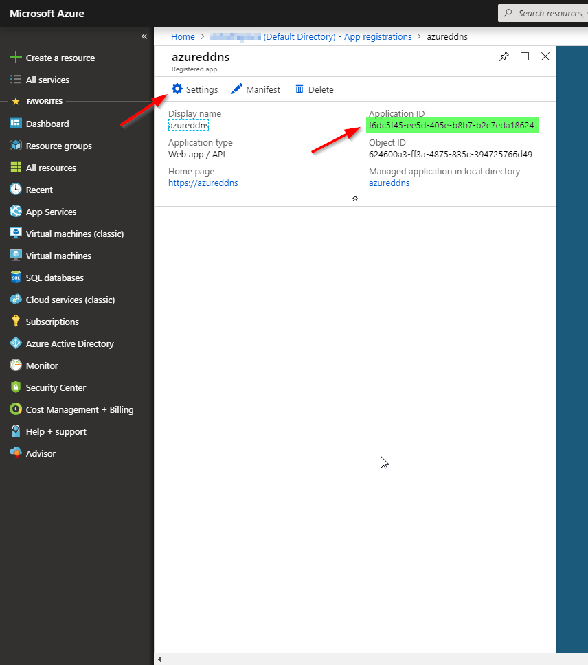
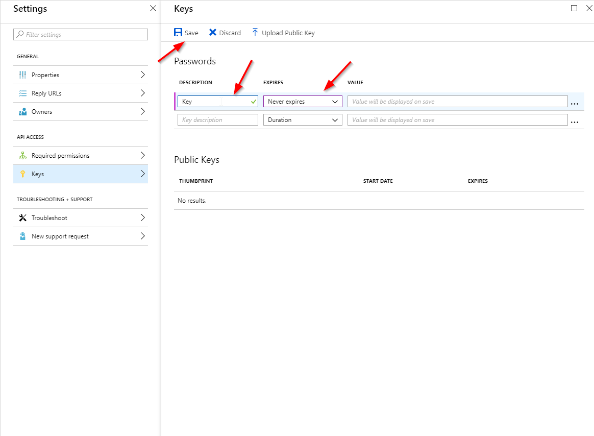
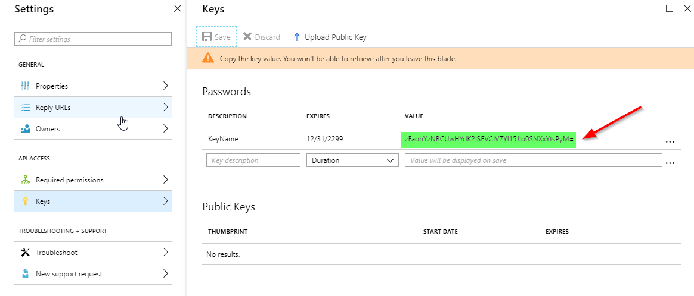
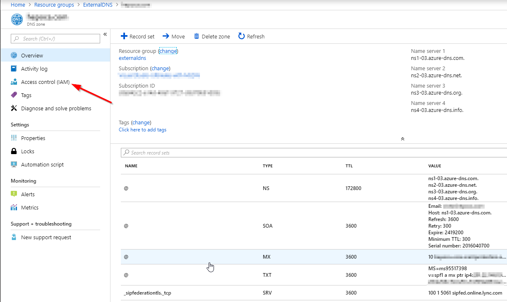
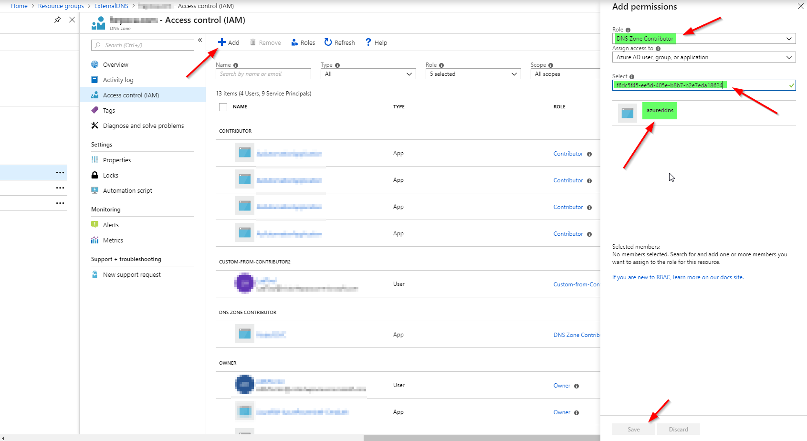

## Register a new application using the Azure portal

1. Sign in to the [Azure portal](https://portal.azure.com).
1. If your account gives you access to more than one, select your account in the top right corner, and set your portal session to the desired Azure AD tenant.
1. In the left-hand navigation pane, select the **Azure Active Directory** service.
1. Select **App registrations** and then select **New application registration**.

    

1. When the **Create** page appears, enter your application's registration information: 

    - **Name:** Enter a meaningful application name like: AzureDDNS
    - **Application type:**
      - Select **Web app/API**.
    - **Sign-On URL:** Use the same name like: https://azureddns 

      

1. When the **Registered app** page appears, take a note of Application ID and click Settings.

      

1. When the **Settings** page appears, click Keys:

    - **Passwords:** Type a name for your Key and select the Expiration time to Never expires then click Save.
    - **ATTENTION!** Once you save the key it will show the password only once. Copy the key value. You won't be able to retrieve after you leave this blade.

    

    

## Add Azure DNS zone permission to ADD Registered App

1. Open your Azure DNS zone and Add the AAD Registered App permission:

    Click Access control (IAM).

    

1. Add the permission as follow:

    - Click Add
    - **Role:** select **DNS Zone Contributor**.
    - **Select:** Select your Azure AD Application created in the previous step. **You can past the applicationID to find it.**
    - Select the application and save.

    

## Installing NodeJSAzureDynamicDNS

1. Using a Linux console:

    - **Using Linux Console run:** 
    
            curl -SL https://raw.githubusercontent.com/Welasco/NodeJSAzureDynamicDNS/master/install.sh | sudo -E bash -
    The files will be installed at ****/opt/NodeJSAzureDynamicDNS****.

## Updating config.json and starting application

1. Using your prefered text editor open /opt/NodeJSAzureDynamicDNS/config.json:

        {
            "updateinterval": 15,
            "CheckPublicIPProviders": [
                "http://ifconfig.co",
                "http://checkip.amazonaws.com/",
                "http://ipecho.net/plain",
                "http://icanhazip.com",
                "http://bot.whatismyipaddress.com",
                "http://ipinfo.io/ip",
                "http://api.ipify.org",
                "http://ipinfo.io/ip",
                "http://wtfismyip.com/text",
                "http://ipv4.icanhazip.com/",
                "http://ifconfig.me"
            ],
            "PublicIPAddress": "",
            "AzureAccountDetails": {
                "AzureSubscriptionID": "xxxxxxxx-xxxx-xxxx-xxxx-xxxxxxxxxxxx",
                "AzureResourceGroup": "ResourceGroup",
                "AzureDNSZone": "company.com",
                "AzureDNSRecord": "www"
            },
            "ServicePrincipal": {
                "authorityHostUrl": "https://login.windows.net",
                "tenant": "company.onmicrosoft.com",
                "applicationId": "xxxxxxxx-xxxx-xxxx-xxxx-xxxxxxxxxxxx",
                "clientSecret": "password",
                "resource": "https://management.core.windows.net/",
                "AzureARMAPIURI": "management.azure.com",
                "token": {
                    "tokenType": "",
                    "expiresIn": 0,
                    "expiresOn": "2000-11-10T17:58:58.402Z",
                    "resource": "",
                    "accessToken": "",
                    "isMRRT": true,
                    "_clientId": "",
                    "_authority": ""
                }
            }
        }    

1. We need to update the following lines:

        "AzureSubscriptionID": "xxxxxxxx-xxxx-xxxx-xxxx-xxxxxxxxxxxx"
        "AzureResourceGroup": "ResourceGroup"
        "AzureDNSZone": "company.com"
        "AzureDNSRecord": "www"     
        "tenant": "company.onmicrosoft.com",
        "applicationId": "xxxxxxxx-xxxx-xxxx-xxxx-xxxxxxxxxxxx"
        "clientSecret": "password"

    **AzureSubscriptionID:** Is your Azure Subscription ID.

    **AzureResourceGroup:** Is the Resource Group name where your Azure dns Zones is located.

    **AzureDNSZone:** Is the Azure DNS Zone name.

    **AzureDNSRecord:** Is your Azure DNS Record name that will be updated.

    **tenant:** Is your tenant name like contoso.onmicrosoft.com.

    **applicationId:** Is your Azure AAD Application ID copied at step 6 in "Register a new application using the Azure portal".

    **clientSecret:** Is your Azure AAD Application secret key copied at step 7 in "Register a new application using the Azure portal".

1. Save the settings.

1. Start the service

        sudo systemctl start UpdateAzureRMDDNS

## Troubleshooting

1. The service will save a log file at:
        
        /opt/NodeJSAzureDynamicDNS/UpdateAzureRMDDNS.log

1. Everytime you start the application it will update the current Public IP Address and until it's not changed it won't trygger a new change. In case you would like to trigger a new update just clen the attribute "PublicIPAddress" at config.json like this:

        "PublicIPAddress": "",

1. By default it will check if your PublicIP has changed in a interval of 15 minutes. You can change it at config.json:

        "updateinterval": 15,
